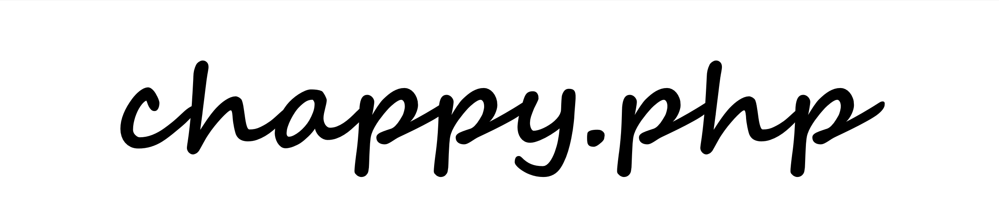

<div style="text-align: center;">
  
</div>

# Chappy.php Starter Application

[Visit our Wiki](https://chapmancbvcu.github.io/chappy-php-starter/)

**Chappy.php** is a lightweight, extensible MVC PHP framework designed for developers who want clarity, power, and flexibility in their projects.

Originally a fork of the Ruah PHP MVC framework inspired by Freeskills’ YouTube series, we've expanded it with modern tools, cleaner structure, and new features.

---  

## 🚀 Quick Start
1. **Install system dependencies**:
  - PHP 8.4+
  - Composer
  - npm
2. **Create a new project**:
  ```bash
  composer create-project chappy-php/chappy-php my-app
  cd my-app
  ```
3. **Run the development server:**
  ```bash
  php console serve
  ```
4. **Start Vite dev server:**
  ```bash
  npm run dev
  ```

Running above command in Windows PowerShell can cause an issue.  Make sure to run with Command Prompt.
---

🧰 Features
- ⚛️ Native React.js View Support
- 💡 Lightweight, fast PHP MVC core
- 🧭 Dynamic routing with controllers
- 🧱 Layouts, components, and templating
- 🔐 Built‑in user authentication & ACL
- ✍️ Custom form handling and validation
- 📥 Secure file uploads
- 🔔 Email service with customizable templates
- 📡 Event/Listener system for decoupled logic
- 🧵 Job dispatching and background queue support
- 🧪 Unit testing with PHPUnit, Vitest, and test API helpers
- 🔥 Vite‑based asset bundling
- 🎛 Symfony Console–powered CLI (console)
- 🌱 Seeders, migrations, and database helpers
- 📊 Doctum‑generated API documentation
- 📖 Built‑in Jekyll user guide
- 🧾 .env configuration via vlucas/phpdotenv
- 📂 Organized PSR‑4 project structure
- 📚 [Jekyll user guide](https://chapmancbvcu.github.io/chappy-php-starter/)

---

## System Requirements
- Apache or Nginx (or XAMPP)
- PHP 8.4
- MySQL or MariaDB
- Composer, Node.js, npm
- SQL Management software
- Composer
- git
- OS: macOS / Linux / Windows 11+

---

📄 Documentation
Full documentation is included with the project. After setup, access:
- 📘 User Guide
- 🔧 API Reference

---

📬 Contact
Questions or suggestions? 📧 chad.chapman2010@gmail.com.
🐛 [Open an issue](https://github.com/chapmancbVCU/chappy-php-framework/issues)

---

🌐 Social
Youtube: https://www.youtube.com/@chappy-php

---

🏆 Credits
1. “mvc” icon by iconixar, from thenounproject.com.
2. Freeskills on YouTube (https://www.youtube.com/playlist?list=PLFPkAJFH7I0keB1qpWk5qVVUYdNLTEUs3)