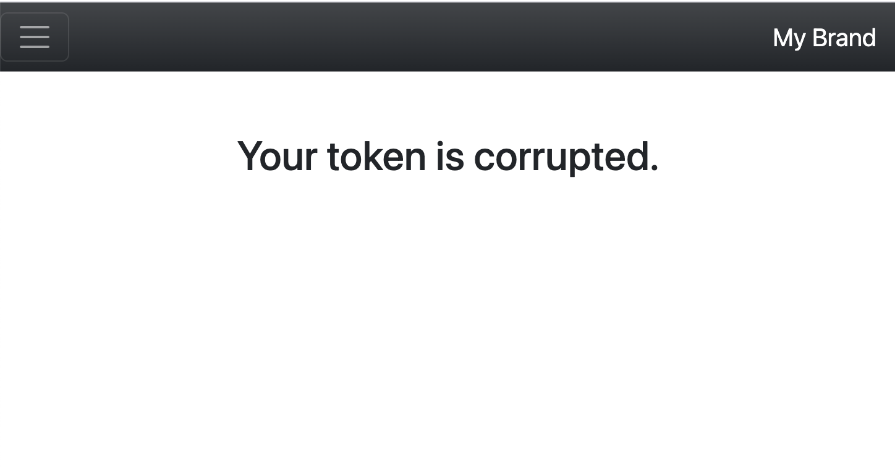

<h1 style="font-size: 50px; text-align: center;">Administration</h1>

## Table of contents
1. [Overview](#overview)
2. [Standard Form](#standard-form)

<br>
<br>

## 1. Overview <a id="overview"></a><span style="float: right; font-size: 14px; padding-top: 15px;">[Table of Contents](#table-of-contents)</span>
This framework supports Cross-Site Request Forgery (CSRF) protection.  Every time a new session is started a new CSRF token is generated.  It is advised that users utilize CSRF checks for all actions associated with forms.  You can implement CSRF checks on all form submissions for submitting and deleting data.
<br>

## 2. Standard Form <a id="standard-form"></a><span style="float: right; font-size: 14px; padding-top: 15px;">[Table of Contents](#table-of-contents)</span>
For Any form you create you can add a CSRF token by adding the following statement to your form:

```php
<?= FormHelper::csrfInput() ?>
```

This statement will added a hidden element containing the session's CSRF token as its value.  Next, within the action associated with your form inside your controller class simply add the following statement:

```php
$this->request->csrfCheck();
```

The convention is to always add this statement immediately following the beginning of the if statement checking if data has been posted.  An example is shown below:

```php
if($this->request->isPost()) {
    $this->request->csrfCheck();
```

Following this procedure ensures that a CSRF check is performed before any processing of form data occurs.  If the CSRF token becomes corrupted the user is redirected to an error view that is shown below:

<div style="text-align: center;">
  
  <p style="font-style: italic;">Figure 1 - Corrupted token view</p>
</div>
<br>