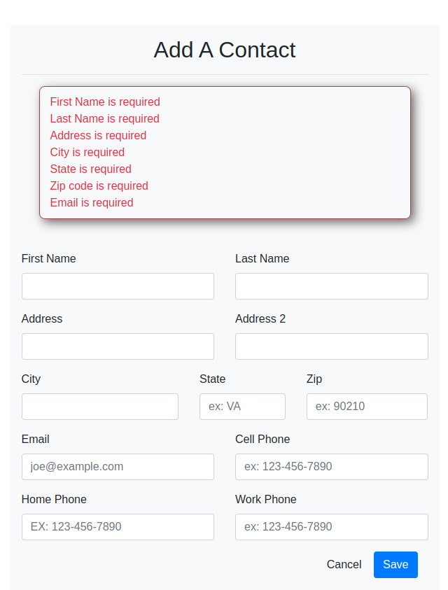
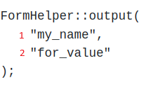
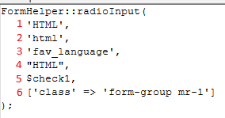
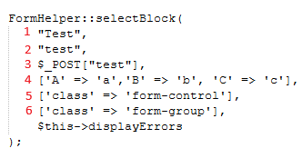

<h1 style="font-size: 50px; text-align: center;">Form Helper Functions</h1>

## Table of contents
1. [Overview](#overview)
2. [appendErrorClass()](#append-error-class)
3. [button()](#button)
4. [buttonBlock()](#buttonblock)
5. [checkboxBlockLabelLeft()](#checkboxBlockLabelLeft)
6. [checkboxBlockLabelRight()](#checkboxblocklabelright)
7. [checkboxGroup()](#checkbox-group)
8. [checkboxInput()](#checkbox-input)
9. [checkToken()](#check-token)
10. [csrfInput()](#csrf-input)
11. [displayErrors()](#displayerrors)
12. [errorMsg()](#error-msg)
13. [generateToken()](#generate-token)
14. [hidden()](#hidden)
15. [inputBlock()](#inputblock)
 * A. [currencyBlock()](#currency-block)
 * B. [emailBlock()](#emailblock)
 * C. [fileBlock()](#file-block)
 * D. [image()](#image)
 * E. [imageBlock()](#image-block)
 * F. [telBlock()](#tel-block)
 * G. [textAreaBlock()](#textarea-block)
16. [dataListBlock()](#datalist-block)
11. [output()](#output)
12. [radioInput()](#radioinput)
13. [posted_values()](#posted-values)
14. [selectBlock()](#selectblock)
15. [stringifyAttrs()](#stringify-attrs)
16. [submitBlock()](#submitblock)
17. [submitTag()](#submittag)

<br>

## 1. Overview <a id="overview"></a><span style="float: right; font-size: 14px; padding-top: 15px;">[Table of Contents](#table-of-contents)</span>
The Rapid Forms feature of this Model View Controller (MVC) Framework allows the user to quickly create and style forms. This guide thoroughly describes the ability to create these HTML form elements along with a description and examples. All form inputs will automatically be sanitized and validation checks will be performed.  If you would like support for additional features please create an issue [here](https://github.com/chapmancbVCU/chappy-php-framework/issues).


<br>

## 2. `appendErrorClass()` <a id="append-error-class"></a><span style="float: right; font-size: 14px; padding-top: 15px;">[Table of Contents](#table-of-contents)
Adds name of error classes to div associated with a form field.

Parameters:
- `array $attrs` - The values used to set the class and other attributes of the input string.  The default value is an empty array.
- `array $errors` - The errors array.
- `string $name` - The name of the field associated with this error.
- `string $class` - Name of the class used to identify errors for a form field.

Returns:
- `array` - Div attributes with error classes added.

<br>

## 3. `button()` <a id="button"></a><span style="float: right; font-size: 14px; padding-top: 15px;">[Table of Contents](#table-of-contents)</span>
This function creates a button with no surrounding HTML div element. It supports the ability to set attributes such as classes and event handlers. If you want a div to surround a button along with any other attributes we recommend that you use the buttonBlock function. Note the example function call shown below:

```php
FormHelper::button(
  "Click Me!", 
  ['class' => 'btn btn-large btn-primary', 'onClick' => 'alert(\'Hello World!\')']
);
```

Parameters: 
- `string $buttonText` - The contents of the button's label.
- `array $inputAttrs` - This parameter is used to set values for attributes such as classes for styling, front-side validation, and event handlers. Make sure when performing an event handler function call that contains strings as arguments to escape any quotes. The default value is an empty array.

Returns:
- An HTML button element with its label set and any other optional attributes set.

<br>

## 4. `buttonBlock()` <a id="buttonblock"></a><span style="float: right; font-size: 14px; padding-top: 15px;">[Table of Contents](#table-of-contents)</span>
The buttonBlock function is a wrapper for the button function that adds a div around the button element. An example function call is shown below.

```php
FormHelper::buttonBlock(
  "Click Me!", 
  ['class' => 'btn btn-large btn-primary', 'onClick' => 'alert(\'Hello World!\')'], 
  ['class' => 'form-group']
);
```

Parameters:
- `string $buttonText` - The contents of the button's label.
- `array $inputAttrs` - This parameter is used to set values for attributes such as classes for styling, front-side validation, and event handlers. Make sure when performing an event handler function call that contains strings as arguments to escape any quotes. The default value is an empty array.
- `array $divAttrs` - The values used to set the class and other attributes of the surrounding div.  The default value is an empty array.

Returns:
- `string` - An HTML div surrounding a button element with its label set and any other optional attributes set.

<br>

## 5. `checkboxBlockLabelLeft()` <a id="checkboxBlockLabelLeft"></a><span style="float: right; font-size: 14px; padding-top: 15px;">[Table of Contents](#table-of-contents)</span>
Generates a checkbox where the label is on the left side. It generates a div element that surrounds a label and input of type checkbox. This is ideal for situations where labels can be of varying lengths. An example function call is shown below.

```php
FormHelper::checkboxBlockLabelLeft(
  'Remember Me', 
  'remember_me', 
  'on', 
  $this->login->getRememberMeChecked(), 
  [], 
  ['class' => 'form-group'], $this->displayErrors
);
```

Parameters:
- `string $label` - Sets the label for this input.
- `string $name` - Sets the value for the name, for, and id attributes for this input.
- `string $value` - The value we want to set.  We can use this to set  the value of the value attribute during form validation.  Default value  is the empty string.  It can be set with values during form validation and forms used for editing records.
- `bool $checked` - The value for the checked attribute.  If true  this attribute will be set as checked="checked".  The default value is false.  It can be set with values during form validation and forms used for editing records.
- `array $inputAttrs` - The values used to set the class and other attributes of the input string.  The default value is an empty array.
- `array $divAttrs` - The values used to set the class and other attributes of the surrounding div.  The default value is an empty array.
- `array $errors` - The errors array.  Default value is an empty array.
Returns:
- `string` - A surrounding div and the input element of type checkbox.

<br>

## 6. `checkboxBlockLabelRight()` <a id="checkboxblocklabelright"></a><span style="float: right; font-size: 14px; padding-top: 15px;">[Table of Contents](#table-of-contents)</span>
Generates a checkbox where the label is on the right side. It generates a div element that surrounds a label and input of type checkbox. An example function call from the login view is shown below.

```php
FormHelper::checkboxBlockLabelRight(
  'Remember Me', 
  'remember_me', 
  'on', 
  $this->login->getRememberMeChecked(), 
  [], 
  ['class' => 'form-group mr-1'], $this->displayErrors
);
```
Parameters:
- `string $label` - Sets the label for this input.
- `string $name` - Sets the value for the name, for, and id attributes for this input.
- `string $value` - The value we want to set.  We can use this to set  the value of the value attribute during form validation.  Default value  is the empty string.  It can be set with values during form validation and forms used for editing records.
- `bool $checked` - The value for the checked attribute.  If true  this attribute will be set as checked="checked".  The default value is false.  It can be set with values during form validation and forms used for editing records.
- `array $inputAttrs` - The values used to set the class and other attributes of the input string.  The default value is an empty array.
- `array $divAttrs` - The values used to set the class and other attributes of the surrounding div.  The default value is an empty array.
- `array $errors` - The errors array.  Default value is an empty array.

Returns:
- `string` - A surrounding div and the input element of type checkbox.

<br>

## 7. `checkboxGroup()` <a id="checkbox-group"></a><span style="float: right; font-size: 14px; padding-top: 15px;">[Table of Contents](#table-of-contents)</span>
Renders a group of checkboxes sharing one name (submitted as name[]), one wrapping div, and ONE error span. Label-right per box.

Example:

```php
<?= FormHelper::checkboxGroup(
  'acls',
  $this->acls,              // [value => label] map of all ACLs
  $this->user->getAcls(),   // the set of ACLs this user currently has
  [],
  ['class' => 'form-check'],
  $this->displayErrors
); ?>
```

Parameters:
- `string $name` - Group name WITHOUT '[]' (added internally), e.g. 'acls'.
- `array $options` - [value => label] map of choices. 
- `array $selectedValues` - Values that should render checked (the current set).
- `array $inputAttrs` - Passthrough attrs applied to every box (error-classed once here).
- `array $divAttrs` - Attrs for the group's wrapping div.
- `array $errors` - Errors array; one invalid-feedback span for the whole group.

Returns:
- `string` - The checkbox group.

<br>

## 8. `checkboxGroup()` <a id="checkbox-group"></a><span style="float: right; font-size: 14px; padding-top: 15px;">[Table of Contents](#table-of-contents)</span>
Renders a single checkbox input with its label — the bare item only, no wrapping div and no error span (the caller owns the envelope). Label sits to the RIGHT of the box by default; pass `$labelRight = false` to place it on the left.

`$inputAttrs` is expected already error-classed by the caller (mirrors radioInput).

Parameters:
- `string $label` - Visible label text.
- `string $name` - Field name. Keep the '`[]`' suffix for group members (e.g. '`genres[]`') so they submit as an array.
- `string $value` -  Submitted value; also used to build a unique id.
- `bool $checked` - Whether this box renders checked.
- `array $inputAttrs` - Passthrough HTML attributes (already error-classed).

Returns:
- `bool $labelRight` - Label on the right of the box (default true).

<br>

## 9. `checkToken()` <a id="check-token"></a><span style="float: right; font-size: 14px; padding-top: 15px;">[Table of Contents](#table-of-contents)</span>
Checks if the csrf token exists.  This is used to verify that there has been no tampering of a form's csrf token.

Parameter:
- `string $token` - token string we will test whether or not it exists.

Returns:
- `bool` - The result of the AND operation on whether or not a token exists with a session and if the session's token is equal to the value of the $token parameter.

<br>

## 10. `csrfInput()` <a id="csrf-input"></a><span style="float: right; font-size: 14px; padding-top: 15px;">[Table of Contents](#table-of-contents)</span>
A hidden input to represent the csrf token in a web form.

Returns: 
- string The hidden input of type hidden with the generated token set as the value.

<br>

## 11. `displayErrors()` <a id="displayerrors"></a><span style="float: right; font-size: 14px; padding-top: 15px;">[Table of Contents](#table-of-contents)</span>
The purpose of this function is to display errors related to validation. An example can be found in Figure 1.  Many frameworks calls this an error bag.

<div style="text-align: center;">
  
  <p style="font-style: italic;">Figure 1 - Display errors example</p>
</div>

Parameters:
- `array|ArraySet $errors` - A list of errors and their description that is generated during server side form validation.

Returns:
- `string` - The error bag.

<br>

## 12. `errorMsg()` <a id="error-msg"></a><span style="float: right; font-size: 14px; padding-top: 15px;">[Table of Contents](#table-of-contents)</span>
Renders an error message for a particular form field.

Parameters:
- `array $errors` - The error array.
- `string $name` - Used to search errors array for key/form field.

Returns:
- `string` - The error message for a particular field.

<br>


## 13. `generateToken()` <a id="generate-token"></a><span style="float: right; font-size: 14px; padding-top: 15px;">[Table of Contents](#table-of-contents)</span>
Creates a randomly generated csrf token. 

Returns:
- string - The randomly generated token.

<br>

## 14. `hidden()` <a id="hidden"></a><span style="float: right; font-size: 14px; padding-top: 15px;">[Table of Contents](#table-of-contents)</span>
Generates a hidden element. An example function call is shown below in figure 7:

Example:
```php
FormHelper::hidden("example_name", "example_value");
```

This function accepts 2 arguments as described below:
1. $name sets the value for the name, for, and id attributes.
2. $value The value for the value attribute.

<br>

## 15. `inputBlock()` <a id="inputblock"></a><span style="float: right; font-size: 14px; padding-top: 15px;">[Table of Contents](#table-of-contents)</span>
A generic block for the input element.  Most input types in the forms global library depend on this function.

Example:

```php
FormHelper::inputBlock(
  'text', 
  'Example', 
  'example_name', 
  example_value, 
  ['class' => 'form-control'], 
  ['class' => 'form-group'], 
  $this->displayErrors
);
```

Parameters:
- `string` $type - The input type we want to generate.
- `string $label` - Sets the label for this input.
- `string $name` - Sets the value for the name, for, and id attributes for this input.
- `mixed $value` - The value we want to set.  We can use this to set  the value of the value attribute during form validation.  Default value  is the empty string.  It can be set with values during form validation and forms used for editing records.
- `bool $checked` - The value for the checked attribute.  If true  this attribute will be set as checked="checked".  The default value is false.  It can be set with values during form validation and forms used for editing records.
- `array $inputAttrs` - The values used to set the class and other attributes of the input string.  The default value is an empty array.
- `array $divAttrs` - The values used to set the class and other attributes of the surrounding div.  The default value is an empty array.
- `array $errors` - The errors array.  Default value is an empty array.

Returns:
- `string` - A surrounding div and the input element.

<br>

### A. `currencyBlock()` <a id="currency-block">
Renders an HTML div element that surrounds an input of type currency.

Example:

```php
<?= FormHelper::currencyBlock(
    label: 'Amount',
    name: "amount",
    inputAttrs: ['class' => 'form-control input-sm'],
    divAttrs: ['class' => 'form-group mb-3']
) ?>
```
Parameters:
- `string $label` - Sets the label for this input.
- `string $name` - Sets the value for the name, for, and id attributes for this input.
- `string $symbol` - The symbol for the currency.
- `mixed $value` - The value we want to set.  We can use this to set  the value of the value attribute during form validation.  Default value  is the empty string.  It can be set with values during form validation and forms used for editing records.
- `bool $checked` - The value for the checked attribute.  If true  this attribute will be set as checked="checked".  The default value is false.  It can be set with values during form validation and forms used for editing records.
- `array $inputAttrs` - The values used to set the class and other attributes of the input string.  The default value is an empty array.
- `array $divAttrs` - The values used to set the class and other attributes of the surrounding div.  The default value is an empty array.
- `array $errors` - The errors array.  Default value is an empty array.

Returns:
- `string` - A surrounding div and the input element of type text for currency.

<br>

### B. `emailBlock()` <a id="emailblock">
Use this function to create styled E-mail form inputs. 

Example:

```php
FormHelper::emailBlock(
  'Email', 
  'email', 
  $this->contact->email, 
  ['class' => 'form-control'], 
  ['class' => 'form-group col-md-6'], 
  $this->displayErrors
);
```

Parameters:
- `string $label` - Sets the label for this input.
- `string $name` - Sets the value for the name, for, and id attributes for this input.
- `string $value` - The value we want to set.  We can use this to set  the value of the value attribute during form validation.  Default value  is the empty string.  It can be set with values during form validation and forms used for editing records.
- `bool $checked` - The value for the checked attribute.  If true  this attribute will be set as checked="checked".  The default value is false.  It can be set with values during form validation and forms used for editing records.
- `array $inputAttrs` - The values used to set the class and other attributes of the input string.  The default value is an empty array.
- `array $divAttrs` - The values used to set the class and other attributes of the surrounding div.  The default value is an empty array.
- `array $errors` - The errors array.  Default value is an empty array.

Returns:
- `string` - A surrounding div and the input element of type email.

<br>

### C. `fileBlock()` <a id="file-block">
Renders an HTML div element that surrounds an input of type file.

Multiple File Uploads:
Use the $multiple flag to enable multiple file uploads.  Name attribute will be formatted correctly and the multiple attribute will be added to the input element.

Example:
```php
<?= FormHelper::fileBlock(
  "Upload Profile Image (Optional)", 
  'profileImage', 
  ['class' => 'form-control', 'accept' => 'image/gif image/jpeg image/png'], 
  ['class' => 'form-group mb-3']
) ?>
```
Parameters:
- `string $label` - Sets the label for this input.
- `string $name` - Sets the value for the name, for, and id attributes for this input.
- `array $inputAttrs` - The values used to set the class and other attributes of the input string.  The default value is an empty array.
- `array $divAttrs` - The values used to set the class and other attributes of the surrounding div.  The default value is an empty array.
- `bool $multiple` - Flag for turning on or off multiple file uploads.

Returns:
- `string` - A surrounding div and the input element of type file.

<br>

### D. `image()` <a id="image">
Create a input element of type image.

Example:
```php
<?= FormHelper::image(
     'submit', 
     asset('public/logo.png', true), 
     100, 
     50, 
     ['class' => 'mt-5 pt-4']
) ?>
```

Parameters:
- `string $id` - The id attribute for the image input.
- `string $src` - The path to the image file.
- `int $width` - The width of the image.
- `int $height` - The hight of the image.
- `array $inputAttrs` - The values used to set the class and other attributes of the input string.  The default value is an empty array.

Returns:
- `string` - An input element of type image.

<br>

### E. `imageBlock()` <a id="image-block">
Create a input element of type image.

Example:
```php
<?= FormHelper::imageBlock(
     'submit', 
     asset('public/logo.png', true), 
     100, 
     50, 
     ['class' => 'mt-5 pt-4'],
     ['class' => 'text-end']
) ?>
```

Parameters:
- `string $id` - The id attribute for the image input.
- `string $src` - The path to the image file.
- `int $width` - The width of the image.
- `int $height` - The hight of the image.
- `array $inputAttrs` - The values used to set the class and other attributes of the input string.  The default value is an empty array.
- `array $divAttrs` - The values used to set the class and other attributes of the surrounding div.  The default value is an empty array.

Returns:
- `string` - An input element of type image.

<br>

### F. `telBlock()` <a id="tel-block"></a>
Renders an HTML div element that surrounds an input of type tel. The user is able to enter cell, home, and work as phone types. Certain options can be set using the args parameter.

This function will be deprecated in version 5.0.0 and the global helper will be used instead.

Example:

```php
<?= FormHelper::telBlock(
     'Home phone', 
     'phone', 
     $this->user->phone, 
     ['class' => 'form-control input-sm'], 
     ['class' => 'form-group mb-3']) 
?>
```

Parameters:
- `string $label` - Sets the label for this input.
- `string $name` - Sets the value for the name, for, and id attributes for this input.
- `mixed $value` - The value we want to set.  We can use this to set the value of the value attribute during form validation.  Default value  is the empty string.  It can be set with values during form validation  and forms used for editing records.
- `array $inputAttrs` - The values used to set the class and other attributes of the input string.  The default value is an empty array.
- `array $divAttrs` - The values used to set the class and other  attributes of the surrounding div.  The default value is an empty array.
- `array $errors` - The errors array.  Default value is an empty array.

Returns:
- string - The HTML div element surrounding an input of type tel with configuration and values set based on parameters entered during function call.

<br>

### G. `textAreaBlock()` <a id="textarea-block">
Assists in the development of textarea in forms. It accepts parameters for setting attribute tags in the form section.  An example function call is shown below:

```php
// Add this to the head section
<?php $this->start('head') ?>
<?= loadTinyMCE() ?>
<?php $this->end() ?>

// The function call
<?= FormHelper::textareaBlock("Description", 
    'description', 
    $this->user->description, 
    ['class' => 'form-control input-sm', 'placeholder' => 'Describe yourself here...'], 
    ['class' => 'form-group mb-3']); 
?>
```
</div>

Parameters:
- `string $label`  Sets the label for this input.
- `string $name` - Sets the value for the name, for, and id attributes  for this input.
- `string|null $value` - The value we want to set.  We can use this to set the value of the value attribute during form validation.  Default value is the empty string.  It can be set with values during form validation and forms used for editing records.
- `array $inputAttrs` - The values used to set the class and other attributes of the input string.  The default value is an empty array.
- `array $divAttrs` - The values used to set the class and other attributes of the surrounding div.  The default value is an empty array.
- `array $errors` - The errors array.  Default value is an empty array.

Returns:
- `string` - A surrounding div and the textarea element.

<br>

## 16. `datalistBlock()` <a id="datalist-block"></a><span style="float: right; font-size: 14px; padding-top: 15px;">[Table of Contents](#table-of-contents)</span>
Assists in the development of forms input blocks with datalist element in forms.  It accepts parameters for setting attribute tags in the form section.


<br>

## 11. `output()` <a id="output"></a><span style="float: right; font-size: 14px; padding-top: 15px;">[Table of Contents](#table-of-contents)</span>
Generates an HTML output element. The output element is a container that can inject the results of a calculator or the outcome of a user action. An example function call is shown below in figure 9:
<div style="text-align: center;">
  
  <p style="font-style: italic;">Figure 9 - Output element function call</p>
</div>

This function accepts 2 arguments as described below:
1. $name Sets the value for the name attributes for this
2. $for Sets the value for the for attribute.
<br>

## 12. `radioInput()` <a id="radioinput"></a><span style="float: right; font-size: 14px; padding-top: 15px;">[Table of Contents](#table-of-contents)</span>
Creates an input element of type radio with an accompanying label element. Compatible with radio button groups.  An example function call is shown below in figure 10:
<div style="text-align: center;">
  
  <p style="font-style: italic;">Figure 10 - Radio button function call</p>
</div>

This function accepts 2 arguments as described below:
1. $label Sets the label for this input.
2. $id	The id attribute for the radio input element.
3. $name	Sets the value for the name, for, and id attributes for this input.
4. $value The value we want to set. We can use this to set the value of the value attribute during form validation. Default value is the empty string. It can be set with values during form validation and forms used for editing records.
5. $checked The value for the checked attribute. If true this attribute will be set as checked="checked". The default value is false. It can be set with values during form validation and forms used for editing records.
6. $inputAttrs	The values used to set the class and other attributes of the input string. The default value is an empty array.

The example code below demonstrates how a radio button groups is used.
```php
FormHelper::radioInput('HTML', 'html', 'fav_language', "HTML", $check1, ['class' => 'form-group mr-1']); 
FormHelper::radioInput('CSS', 'css', 'fav_language', "CSS", $check2, ['class' => 'form-group mr-1']);
```

<br>

## 13. `posted_values()` <a id="posted-values"></a><span style="float: right; font-size: 14px; padding-top: 15px;">[Table of Contents](#table-of-contents)</span>
Sanitizes values from $_POST input arrays to prevent malicious script injection.
```php
$post = FormHelper::posted_values($_POST);
```

<br>

## 14. `selectBlock()` <a id="selectblock"></a><span style="float: right; font-size: 14px; padding-top: 15px;">[Table of Contents](#table-of-contents)</span>
Renders a select element with a list of options.  An example function call is shown below in figure 11: 
<div style="text-align: center;">
  
  <p style="font-style: italic;">Figure 11 - Select block function call</p>
</div>

This function accepts 7 arguments as described below:
1. $label Sets the label for this input.
2. $name Sets the value for the name, for, and id attributes for this input.
3. $value The value we want to set as selected.
4. $inputAttrs The values used to set the class and other attributes of the input string.  The default value is an empty array.
5. $options The list of options we will use to populate the select option dropdown.  The default value is an empty array.
6. $divAttrs The values used to set the class and other attributes of the surrounding div.  The default value is an empty array.
7. **$errors** – (optional) Array of field-specific error messages. Default is an empty array.

<br>

## 15. `stringifyAttrs()` <a id="stringify-attrs"></a><span style="float: right; font-size: 14px; padding-top: 15px;">[Table of Contents](#table-of-contents)</span>
The `stringifyAttrs` function is a utility method used internally by other `FormHelper` functions. Its purpose is to convert an associative array of HTML attributes into a properly formatted string that can be directly inserted into an HTML tag. This makes it easier to dynamically construct form fields with customizable attributes such as `class`, `id`, `placeholder`, and event listeners.

While this function is typically used by the framework internally, understanding it can help when extending or customizing form rendering.

**Example Usage**
```php
$attrs = [
  'class' => 'form-control',
  'placeholder' => 'Enter your name',
  'onfocus' => "this.select()"
];

echo FormHelper::stringifyAttrs($attrs);
```

**Output**
```php
 class="form-control" placeholder="Enter your name" onfocus="this.select()"
```

As shown, the function iterates over the array and produces a valid string of HTML attributes with proper spacing. This string is then injected into tag constructors like `<input>`, `<select>`, `<textarea`>, or `<button>` elements.

**When You Might Use This**
-Creating your own custom form rendering methods.
- Passing additional attributes dynamically through controller logic.
- Building reusable components that take optional HTML attributes

<br>

## 16. `submitBlock()` <a id="submitblock"></a><span style="float: right; font-size: 14px; padding-top: 15px;">[Table of Contents](#table-of-contents)</span>
Generates a div containing an input of type submit.

<br>

## 17. `submitTag()` <a id="submittag"></a><span style="float: right; font-size: 14px; padding-top: 15px;">[Table of Contents](#table-of-contents)</span>
Create a input element of type submit.

