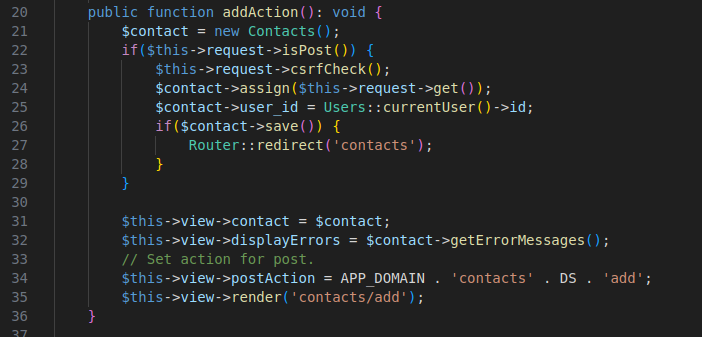
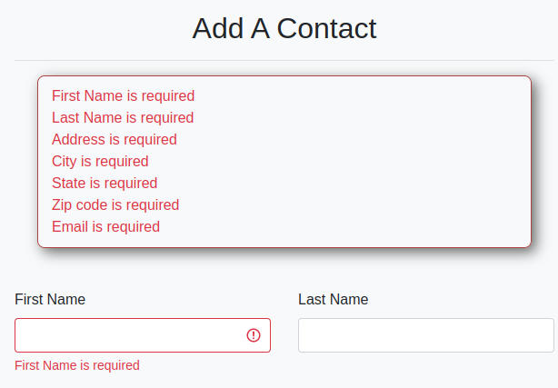

<h1 style="font-size: 50px; text-align: center;">Server Side Validation</h1>

## Table of contents
1. [Overview](#overview)
2. [Setup](#setup)
3. [Validation Rules](#validation-rules)
4. [Custom Validators](#custom_validators)
5. [Why Front-End Validation Matters](#front-end)

<br>

## 1. Overview <a id="overview"></a><span style="float: right; font-size: 14px; padding-top: 15px;">[Table of Contents](#table-of-contents)</span>

Validators available in the `HasValidators` trait class can be used to validate forms.  They are available through the `Model` class and there is no need to import.

<br>

## 2. Setup <a id="setup"></a><span style="float: right; font-size: 14px; padding-top: 15px;">[Table of Contents](#table-of-contents)</span>
Use the `validator()` method in your model and call it automatically when save() is invoked.  Let's use the addAction function from an example ContactsController class. As shown below on line 32, we have a displayErrors property for the View class. We generally set this value to a function call called getErrorMessages on the model. In this case, we are using the $contacts model because we want to add a new contact.

<div style="text-align: center;">
  
  <p style="font-style: italic;">Figure 1 - Controller side setup</p>
</div>

In the form you have two ways display errors:
1. At the top of the form (general errors).  You can also use the globally declared version called `errorBag`.
2. Inline with input elements (specific field errors).

The form setup is shown below in figure 2.

<div style="text-align: center;">
  
  <p style="font-style: italic;">Figure 2 - Form setup</p>
</div>

The result of submitting a form without entering required input is shown below. Note the box above all for elements. All action items will be listed here. Notice that since we added $this->displayErrors as an argument for the FormHelper::inputBlock for first name that the same message is below it as well along with styling around the input field.

<div style="text-align: center;">
  
  <p style="font-style: italic;">Figure 3 - Front end messages</p>
</div>
<br>

<br>

## 3. Validation Rules <a id="validation-rules"></a><span style="float: right; font-size: 14px; padding-top: 15px;">[Table of Contents](#table-of-contents)</span>
**Validator Method**

Each model defines its own validator() method:

```php
public function validator(): void {
    // Enter your validation function calls here.
}
```

You can easily create a model with this function already created from the console by running the following command:

```sh
php console make:model ${Modelname}
```

<br>

**Individual Validation Example**

Here is an example from the `Users` model `validator` function for the `fname` field.

```php
$this->runValidation($this->required()->fieldName('First Name')->max(150)->validate($this->fname));
```

As the parameter, chain your validators to `$this` and make sure the field to be validated is the argument for the final `validate` function call.

Short-form Example:
```php
$this->runValidation('fname', 'First Name', ['required', 'max:150']);
```

Similar to the short-form method of console validation, you provide the validators as an array.  Using this method the `runValidation()` accepts the following parameters.

Parameters:
- `bool|object $param` - The results of the validation operation or the name of the field to be tested.
- `string $fieldName` - The name of the field to be displayed in the error message.
- `array $validators` - An array of validators and any attributes that affect validation behavior.

<br>

## 4. Custom Validators <a id="custom_validators"></a><span style="float: right; font-size: 14px; padding-top: 15px;">[Table of Contents](#table-of-contents)</span>
Custom validators can be implemented within your model classes.  Use the following boiler plate to build your own validators.

```php
public function myValidator(optionalParams): static {
    return $this->setValidator(function($response) use(optionalParams): void {
        if($response == null) return;

        // Validator implementation

        if(condition fails) {
            $this->addErrorMessage('My error message'); 
        }
    });
}
```

<br>

## 5. Why Front-End Validation Matters <a id="front-end"></a><span style="float: right; font-size: 14px; padding-top: 15px;">[Table of Contents](#table-of-contents)</span>
While server-side validation is essential for application security and enforcing business rules, front-end validation enhances the user experience by providing instant feedback. Common examples include:
- Realtime password match checks
- Enforcing required fields before submission
- Format validation (e.g., email, phone numbers)

This framework includes JavaScript tools (see the [JavaScript and Vite section](javascript)) that support these features. For production-ready apps, always use both front-end and server-side validation together.

To include attributes for HTML5-based validation, use the `$inputAttrs` array in the form helper functions:
```php
FormHelper::inputBlock('text', 'State', 'state', $this->contact->state, [
    'class' => 'form-control',
    'pattern' => '[A-Z]*',
    'placeholder' => 'ex: VA'
], ['class' => 'form-group col-md-3'], $this->displayErrors);
```

In this case:
- `pattern` enforces all-uppercase state abbreviations
- `placeholder` gives users an example

Another example for ZIP code:
```php
FormHelper::inputBlock('text', 'Zip', 'zip', $this->contact->zip, [
    'class' => 'form-control',
    'pattern' => '[0-9]*',
    'placeholder' => 'ex: 90210'
], ['class' => 'form-group col-md-4'], $this->displayErrors);
```

JavaScript enhancements like password match validation can be injected into HTML automatically:

```php
<script src="<?=Env::get('APP_DOMAIN', '/')?>resources/js/frontEndPasswordMatchValidate.js"></script>
```
